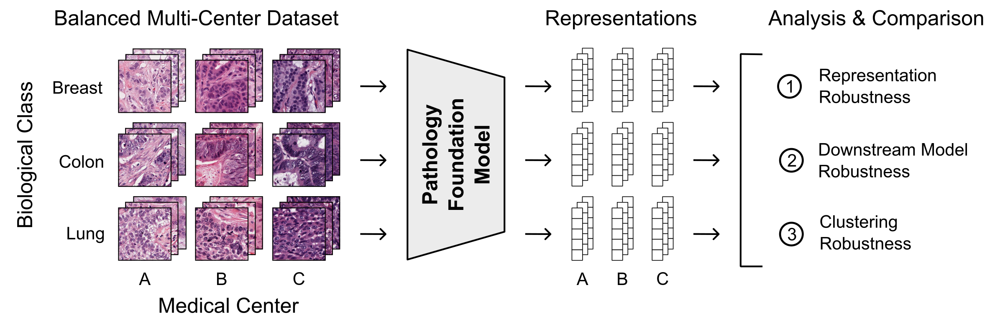

# PathoROB




## Installation

```shell
conda create -n "pathorob" python=3.10 -y
conda activate pathorob
pip install -r requirements.txt
```

> [!Note]
> To ensure that the conda environment does not contain any user-specific site packages (e.g., from ~/.local/lib), run `export PYTHONNOUSERSITE=1` after activating your environment.


## Feature extraction

```
python3 -m pathorob.features.extract_features \
--model uni2h_clsmean \
--model_args '{"hf_token": "<TOKEN>"}'
```

- Results: `data/features/uni2h_clsmean`
- Further arguments: `pathorob/features/extract_features.py`

## Running the benchmark

### (a) Robustness index

```
python3 -m pathorob.robustness_index.robustness_index \
--model uni2h_clsmean \
--dataset { camelyon OR tcga OR tolkach_esca }
```

- Results: `results/robustness_index`
- Further arguments: `pathorob/robustness_index/robustness_index.py`

### (b) Average performance drop (APD)

```
python3 -m pathorob.apd.apd_per_dataset \
--model uni2h_clsmean \
--dataset { camelyon OR tcga OR tolkach_esca }
```

- Results: `results/apd`
- Further arguments: `pathorob/apd/apd_per_dataset.py`

### (c) Clustering score

```
python3 -m pathorob.clustering_score.clustering_score \
--model uni2h_clsmean \
--dataset { camelyon OR tcga OR tolkach_esca }
```

- Results: `results/clustering_score`
- Further arguments: `pathorob/clustering_score/clustering_score.py`

## Adding your own model

1. Create a new Python file in `pathorob.models`.
2. Import the `ModelWrapper` from `pathorob.models.utils`.
3. Define a new model wrapper class and implement the required functions (see template below).
   - Examples: `pathorob.models.uni` or `pathorob.models.phikon`.
4. Add your model wrapper to the `load_model` function in `pathorob.models.__init__` and choose a `model_name`.
5. Run the feature extraction script using your `model_name`.
   - `python3 -m pathorob.features.extract_features --model <model_name>`

```python
from pathorob.models.utils import ModelWrapper


class MyModelWrapper(ModelWrapper):

    def __init__(self, ...):
        """
        Optional: Define custom arguments that can be passed to the model in the
        extract_features entrypoint via `--model_args` as a dictionary. 
        """

    def get_model(self):
        """
        :return: A model object (e.g., `torch.nn.Module`) that has an `eval()` and a
        `to(device)` method.
        """

    def get_preprocess(self):
        """
        Preprocessing to apply to raw PIL images before passing the data to the model.

        :return: A function or an executable object (e.g., `torchvision.transforms.Compose`)
            that accepts a `PIL.Image` as input and returns what the `extract` function
            needs for feature extraction. Note that the result will be batched by the
            default `collate_fn` of a torch DataLoader (`torch.utils.data.DataLoader`).
        """

    def extract(self, data) -> torch.Tensor:
        """
        Feature extraction step for preprocessed and batched image data.

        :param data: (batch_size, ...) A batch of preprocessed image data. The images were
            preprocessed individually via `get_preprocess()` and batched via the default
            `collate_fn` of a torch DataLoader  (`torch.utils.data.DataLoader`).
        :return: (batch_size, feature_dim) A torch Tensor containing the extracted features.
        """
```
